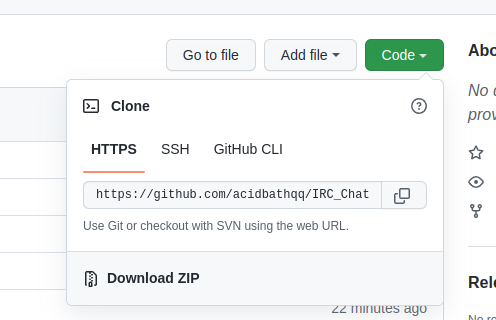
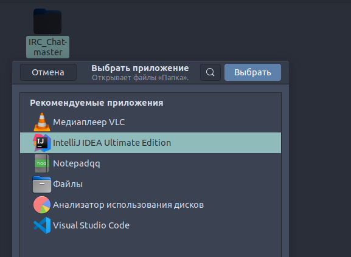
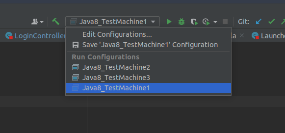
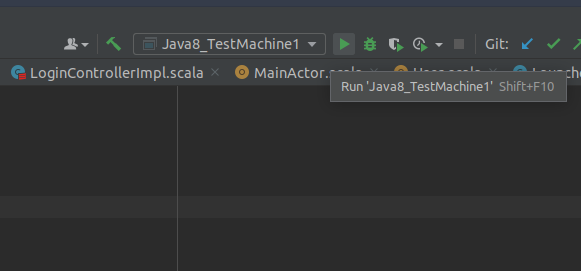
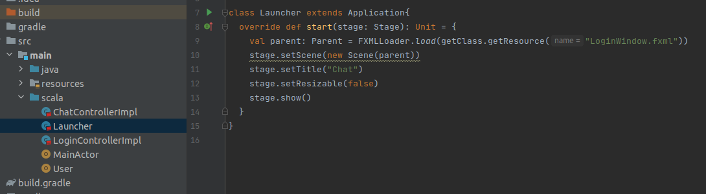
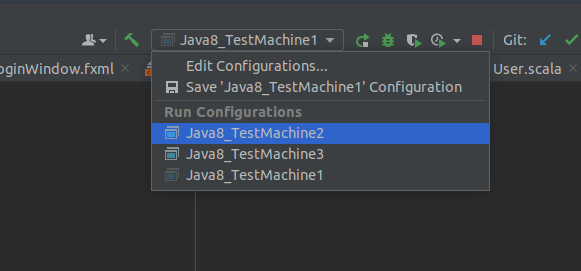
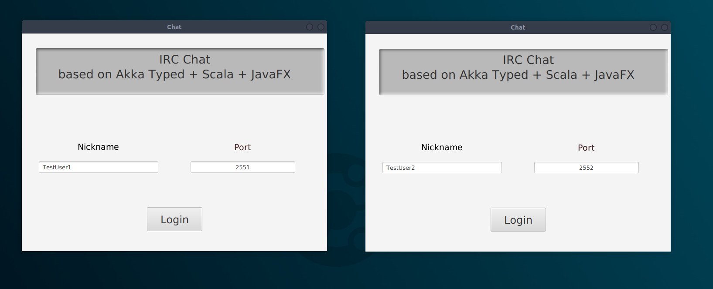
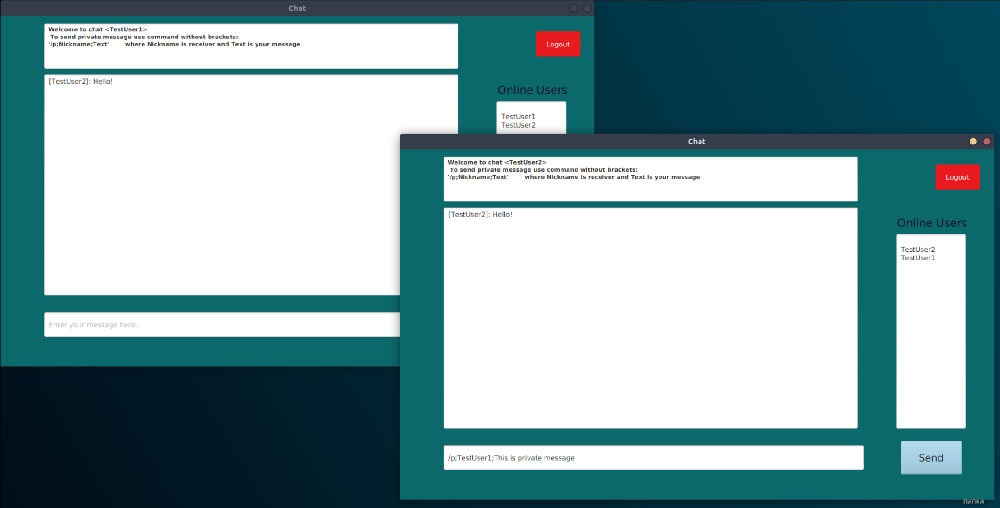
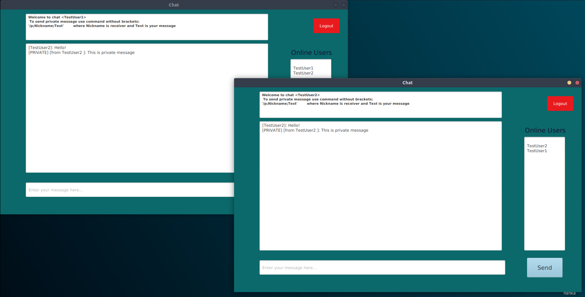
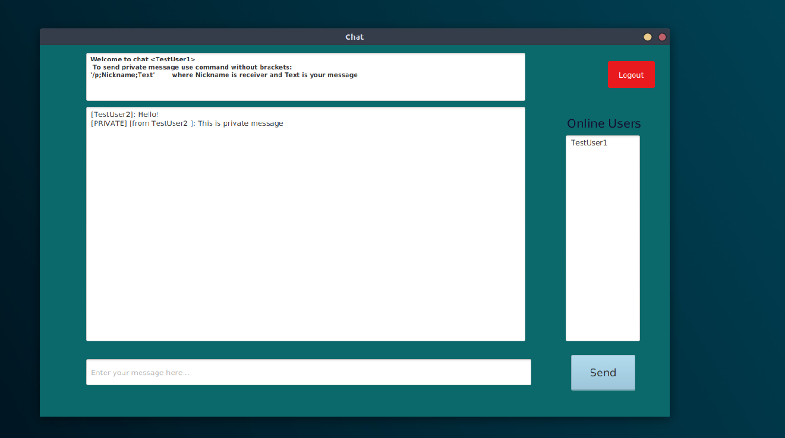

# Инструкция по запуску чата

1. Скачайте zip-файл с проектом

2. После загрузки распакуйте архив и откройте папку в Intellij Idea

3. Запустите через конфигурацию "Java8_TestMachine1" 

4. Если кнопки "Run" нет, первый запуск через класс Launcher в директории "src/main/scala/Launcher.scala"

5. Выберите конфигурацию "Java8_TestMachine2"  и запустите её

6. Введите никнейм для чата, а так же порт. Для первого пользователя порт=2551 , для следующих 2552 и т.д.

7. Сообщения отправляются кнопкой "Send"
 Приватные сообщения отправляются по шаблону __"/p;Nickname;Text" (bold)__    ,где Nickname - это получатель сообщения и Text - отправляемое сообщение
 
 
 
 
 8. Для правильного выхода из системы рекомендуется нажимать кнопку "Logout" 
 
 
